# ComfyUI Smart Model Loader

A complete, pipe-first diffusion workflow for ComfyUI: load models, build text
conditioning, sample, decode, and acquire verified model files without turning
your canvas into a wall of connections.

Version **1.0.1** includes eleven Nodes 2.0-ready nodes. ComfyUI Eclipse is
optional.

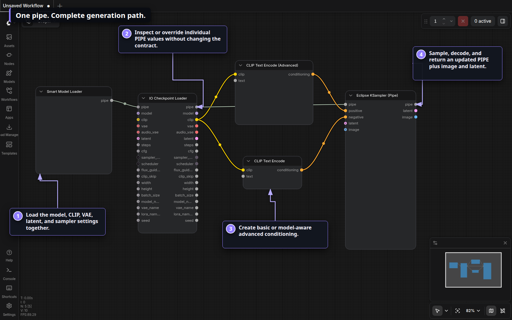

## Why use it?

- **One stable PIPE connection** carries the model, CLIP, VAE, latent,
  dimensions, sampler settings, seed, and names.
- **One adaptive loader** supports checkpoints, UNets, Nunchaku, and GGUF while
  showing only the controls you enable.
- **A complete generation path** includes basic and advanced CLIP encoding,
  model-aware conditioning cleanup, pipe inspection, sampling, and VAE decode.
- **Verified acquisition** inspects exact CivitAI or Hugging Face files before
  adding them to a persistent download queue.
- **Workflow compatibility** preserves the historical `[Eclipse]` node IDs, so
  existing workflows load without node replacement.

## Visual tour

### Find every node in one menu

The pack has its own top-level **Smart Model Loader** category. Nodes are grouped
into Conditioning, Loader, Pipe, and Sampler submenus.

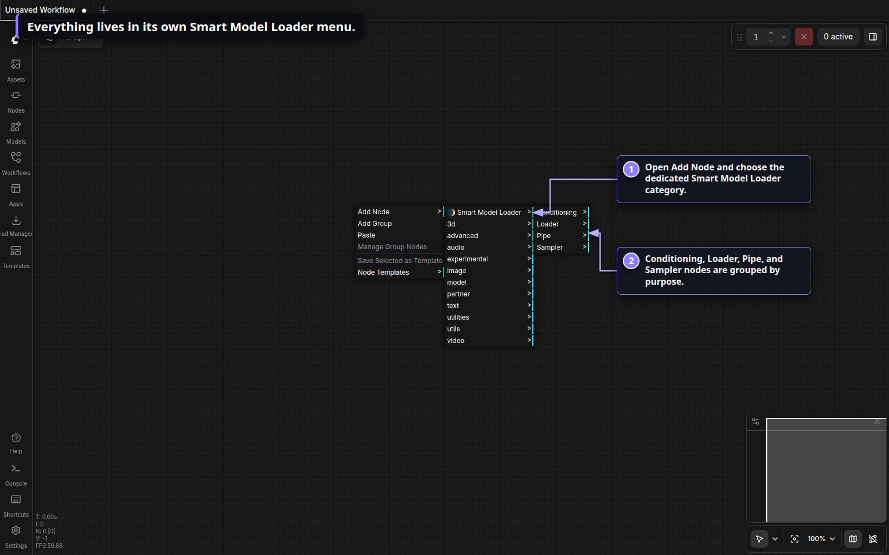

### Start compact

The default Smart Model Loader exposes the common checkpoint path: model type,
baked CLIP, baked VAE, memory cleanup, and one PIPE output.

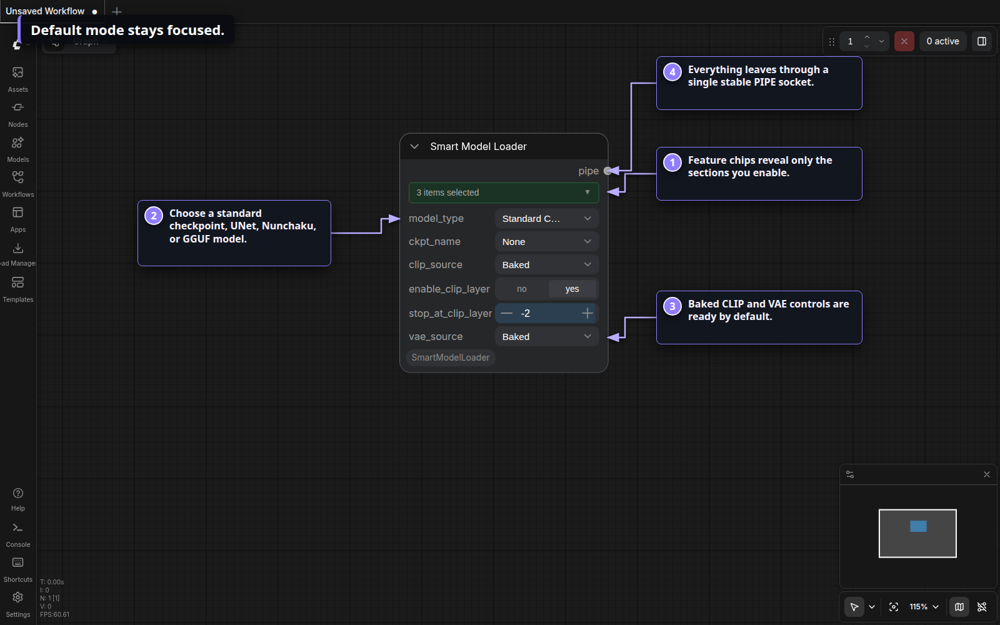

### Open the chip bar

The feature bar controls the node's optional sections. Selected chips reveal
their widgets immediately; inactive sections stay out of the way.

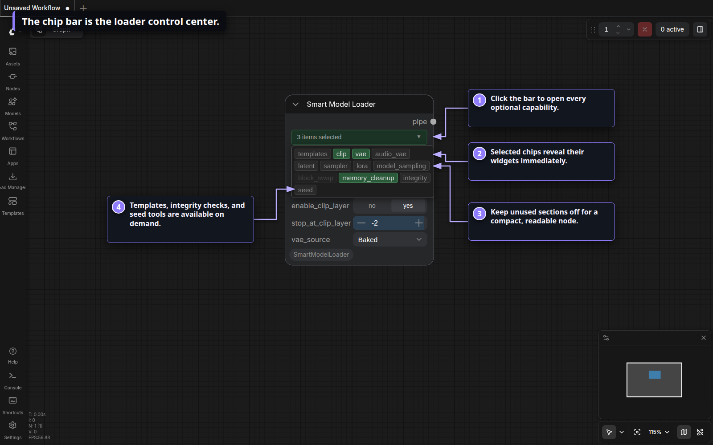

Available chips are `templates`, `clip`, `vae`, `audio_vae`, `latent`,
`sampler`, `lora`, `model_sampling`, `block_swap`, `memory_cleanup`, `integrity`,
and `seed`. Block swap is disabled when ComfyUI's native dynamic VRAM management
already owns that job.

### Build the loader you need

Enable latent, sampler, seed, LoRA, integrity, or architecture-specific sampling
only when the workflow needs them. The serialized workflow retains the selected
feature state.

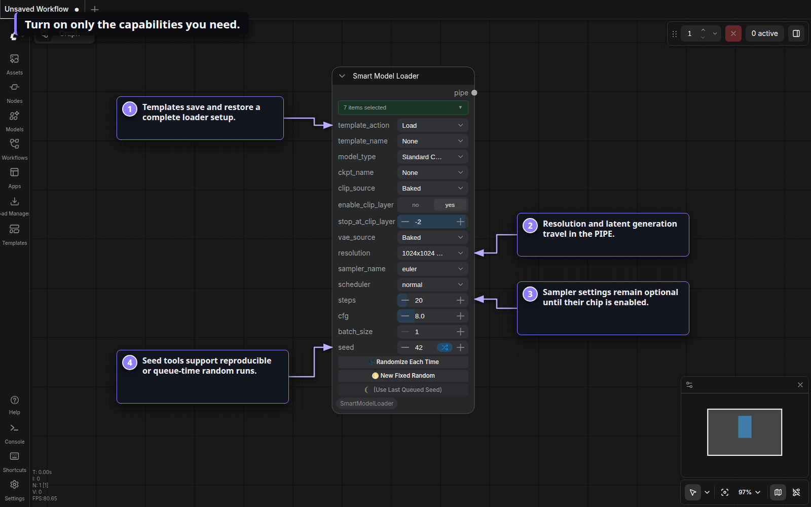

### Load a template

Enable `templates`, choose **Load**, then select a bundled or saved template.
The selection applies the template's enabled loader and generation settings.
**Delete Template** removes only that saved configuration—not any model files.

Templates live in
`ComfyUI/custom_nodes/ComfyUI_SmartModelLoader/templates/`.

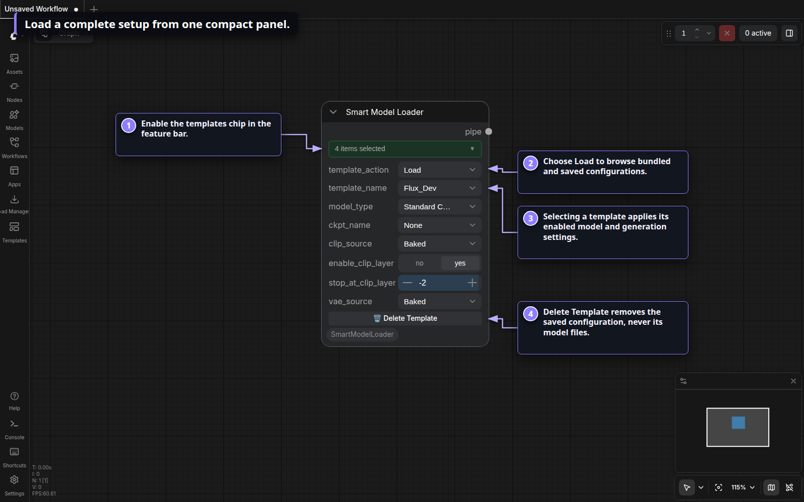

#### Recover a model referenced by a template

Loading a template never downloads files automatically. If its primary model is
not installed, the loader keeps the referenced filename selected with a
`(missing)` marker, restores the saved CivitAI AIR or SHA-256 identity, infers the
registered destination, and reveals **Download from CivitAI**.

The bundled `Krea2_RedCraft` template below restores its Krea2 CLIP, external VAE,
sampler settings, and missing UNet reference. Pressing the download action resolves
the provider file for the selected precision, verifies it, saves it under the shown
model role, and refreshes the node. Until that button is pressed, no transfer starts.

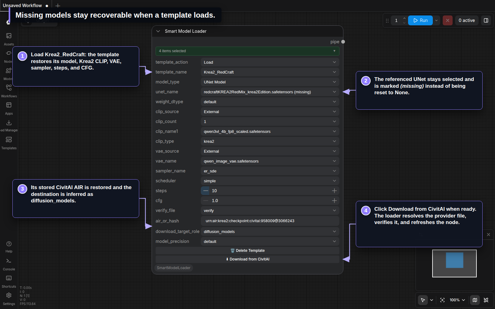

### Use focused loaders when you want direct control

The standalone Model, CLIP, and VAE loaders are useful for modular UNet,
Nunchaku, GGUF, video, and audio setups. `IO Checkpoint Loader` merges direct
components over an incoming PIPE and exposes the result on individual sockets.

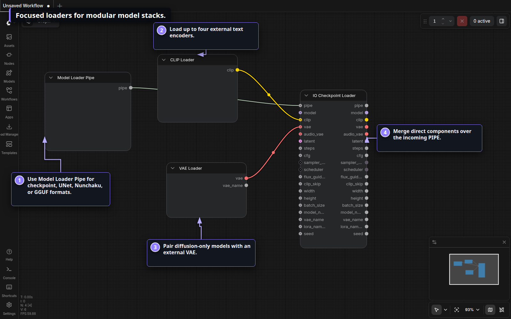

### Shape conditioning

Use the basic encoder for ordinary scheduled conditioning. The Advanced encoder
adds a multiplier and Krea2 layer-rebalancing presets, while Conditioning Zero
Out clears tensors and can choose a known model's base token length.

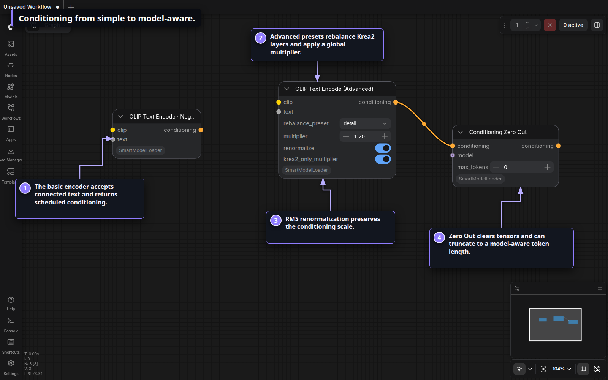

### Sample from the PIPE

`Eclipse KSampler (Pipe)` reads its model and VAE from the PIPE, accepts positive
and negative conditioning, supports image or latent input, and returns a copied
PIPE containing the sampled latent and decoded image. It also provides pipe/widget
precedence, tiled VAE decode, preview modes, and queue-time seed controls.

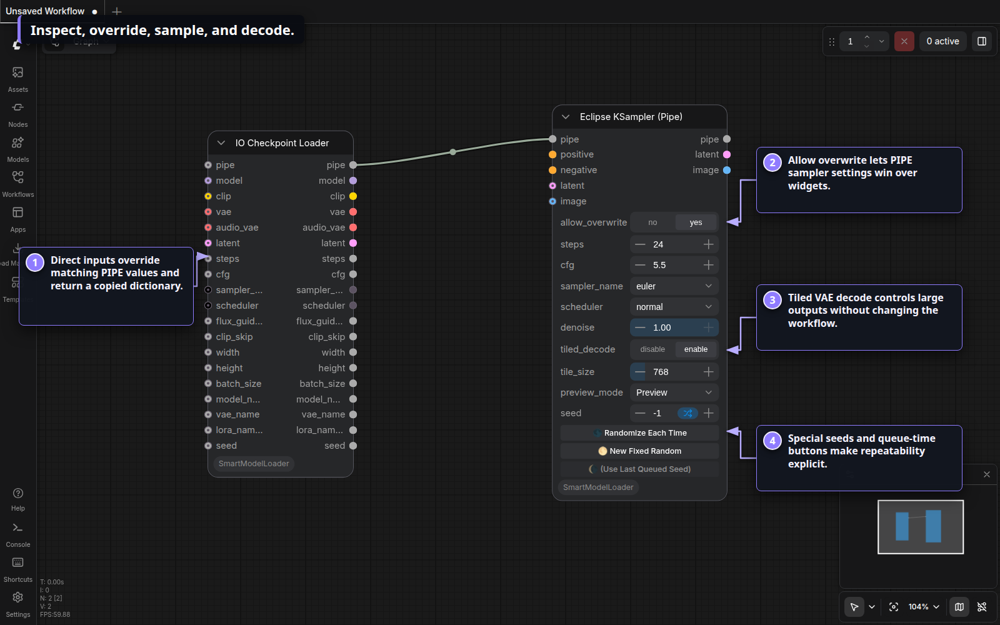

### Acquire exact model files

Open **Download Manager (Beta)** from the Smart Model Loader menu. Inspect a
CivitAI AIR/hash/URL or Hugging Face repository, select exact compatible files,
choose their registered model destinations, and monitor the persistent queue.

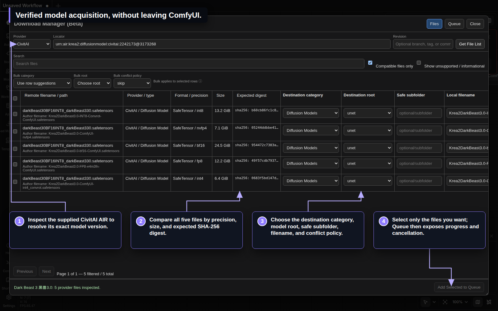

## Included nodes

| Group | Node | Purpose |
| --- | --- | --- |
| Loader | `Smart Model Loader [Eclipse]` | Adaptive all-in-one loader with templates and optional generation settings |
| Loader | `Model Loader [Eclipse]` | Load model components on direct sockets |
| Loader | `Model Loader Pipe [Eclipse]` | Load model components into one PIPE |
| Loader | `CLIP Loader [Eclipse]` | Load one to four external text encoders |
| Loader | `VAE Loader [Eclipse]` | Load an external image/video VAE |
| Loader | `VAE Loader Video+Audio [Eclipse]` | Load separate video and audio VAEs |
| Conditioning | `CLIP Text Encode [Eclipse]` | Build scheduled conditioning from connected text |
| Conditioning | `CLIP Text Encode (Advanced) [Eclipse]` | Apply multipliers and Krea2 layer rebalancing |
| Conditioning | `Conditioning Zero Out [Eclipse]` | Clear and optionally truncate conditioning |
| Pipe | `IO Checkpoint Loader [Eclipse]` | Merge, override, and expose checkpoint PIPE values |
| Sampler | `Eclipse KSampler (Pipe) [Eclipse]` | Sample, VAE-decode, preview, and update the PIPE |

The `[Eclipse]` suffixes are compatibility identifiers. Smart Model Loader owns
these eleven implementations and does not require Eclipse at runtime.

## Installation

### ComfyUI Manager

Search for **ComfyUI Smart Model Loader**, install it, and restart ComfyUI.

### Manual

From your ComfyUI installation:

```bash
cd custom_nodes
git clone https://github.com/r-vage/ComfyUI_SmartModelLoader.git
cd ComfyUI_SmartModelLoader
python -m pip install -r requirements.txt
```

Restart ComfyUI, then open **Add Node → Smart Model Loader**. Settings appear
under **Smart Model Loader → General** and use `SmartModelLoader.*` IDs.

Nunchaku and GGUF model types require their respective ComfyUI integrations.
Without them, the standard checkpoint, UNet, conditioning, pipe, sampler, and
Download Manager features remain available.

## Compatibility and ownership

- Saved workflows keep the same node IDs, schemas, socket order, PIPE keys, and
  template format.
- The pack owns `/smart-model-loader/...` routes, its private `config.json`, and
  its Download Manager queue.
- On first startup, missing loader templates and relevant legacy Eclipse loader
  data can be copied into this pack. Originals are not moved or deleted.
- Optional Eclipse nodes—Context Image, Generation Data, generic channel pipes,
  Concat Pipe Multi, Smart Sampler Settings, Save Images, Kargim, and
  Conditioning Passer—can consume the same PIPE contract.

## Guides

- [Smart Model Loader reference](Readme/Smart_Loaders.md)
- [Standalone loaders](Readme/Checkpoint_Loaders.md)
- [Pipeline nodes](Readme/Pipeline_Nodes.md)
- [Download Manager](Readme/Download_Manager.md)
- [Security model](Readme/Model_Loader_Security.md)

For bugs and feature requests, use the
[GitHub issue tracker](https://github.com/r-vage/ComfyUI_SmartModelLoader/issues).

Licensed under Apache-2.0. See [LICENSE](LICENSE) and [NOTICE](NOTICE).
